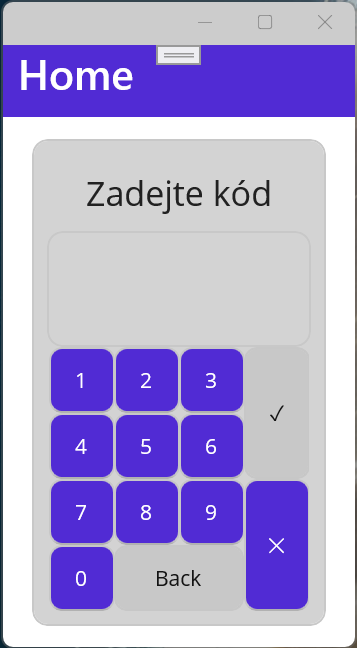
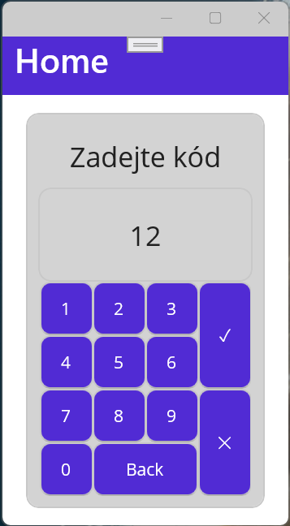
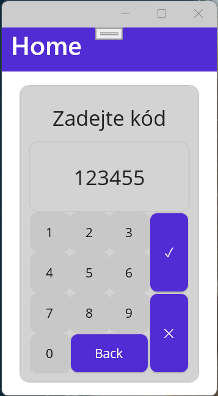
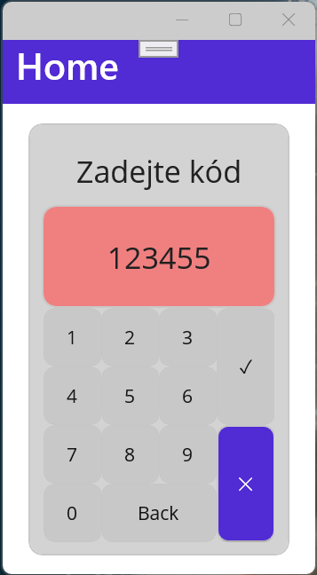
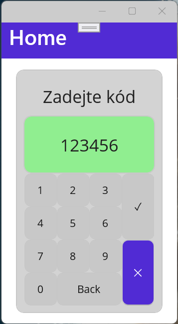

# Test na MVVM v prostředí MAUI

Vytvořte fiktivní aplikaci pro zadávání číselného kódu. Předmětem testu je připojení ViewModelu ke stránce, bindování komponent, použití commandů s parametrem a podmínkou.

## Screenshoty

## Chování aplikace

* Číslice 
	* Jsou aktivní pokud nemá kód délku 6 znaků a stav aplikace je InProgress
	* Přidávají nový znak na konec kódu
* Back 
	* Odmazává poslední znak 
	* Je aktivní, pokud je v kódu alespoň jeden znak a stav aplikace je InProgress
* OK 
	* Vyhodnocuje zadaný kód a podle toho nastavuje vlastnost State
	* Je aktivní pro více než dva znaky a stav aplikace je InProgress
* Storno 
	* Resetuje stav aplikace - tedy kód i stav
	* Je aktivní vždy
* Bindovatelné vlastnosti
	* Aplikace má dvě: Code a State

## Zadání

* ViewModel
	* 2 Bindovatelné vlastnosti
	* 4 Commandy
* Provázat vlastnosti a Commandy tak, aby se vše zobrazovalo správně
* Připojit ViewModel do stránky
* Converter pro převod mezi stavem aplikace a barvou Frame pod kódem

## Fragmenty kódu

	Code = Code.Remove(Code.Length - 1, 1);

